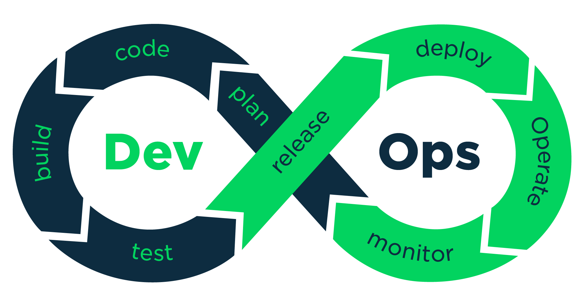

<!-- Improved compatibility of back to top link: See: https://github.com/molro/backend/pull/73 -->
<!--
*** Thanks for checking out the Best-README-Template. If you have a suggestion
*** that would make this better, please fork the repo and create a pull request
*** or simply open an issue with the tag "enhancement".
*** Don't forget to give the project a star!
*** Thanks again! Now go create something AMAZING! :D
-->


<!-- PROJECT SHIELDS -->
<!--
*** I'm using markdown "reference style" links for readability.
*** Reference links are enclosed in brackets [ ] instead of parentheses ( ).
*** See the bottom of this document for the declaration of the reference variables
*** for contributors-url, forks-url, etc. This is an optional, concise syntax you may use.
*** https://www.markdownguide.org/basic-syntax/#reference-style-links
-->
<!-- PROJECT LOGO -->
<br />
<div align="center">
  <a href="https://github.com/molro/backend">
    
  </a>

  <h3 align="center">Pre built Backend</h3>

  <p align="center">
    🎯 Learn the foundations for work with a pre built backend
    <br />
    <a href="https://github.com/molro/backend"><strong>Explore the docs »</strong></a>
    <br />
    <a href="https://github.com/molro/backend/issues">Report Bug</a>
    ·
    <a href="https://github.com/molro/backend/issues">Request Feature</a>
  </p>
</div>


<!-- TABLE OF CONTENTS -->
<details>
  <summary>Table of Contents</summary>
  <ol>
    <li>
      <a href="#about-the-project">About</a>
      <ul>
        <li><a href="#built-with">Built With</a></li>
      </ul>
    </li>
    <li>
      <a href="#getting-started">Getting Started</a>
      <ul>
        <li><a href="#prerequisites">Prerequisites</a></li>
        <li><a href="#installation">Installing </a></li>
      </ul>
    </li>
    <li><a href="#roadmap">Roadmap</a></li>
    <li><a href="#license">License</a></li>
    <li><a href="#contact">Contact</a></li>
    <li><a href="#acknowledgments">Acknowledgments</a></li>
  </ol>
</details>


<!-- ABOUT THE PROJECT -->
## About The Project

Reducing the time that our software takes from development to production environment is one of the principles of DevOps culture. Part of this is creating environments for software engineers for code and testing in the same conditions as production environments.

The use of containers helps us to achieve this and allows us to create portable development environments with the same features of the environment where the software will be running.


Here's why:
* Your time should be focused on creating solutions to solves a problem and helps others
* You shouldn't be installing and uninstalling version of your languages over and over for each project.
* You should implement KISS principles to the rest of your life :smile:


During this tutorial we will learn how to work with the backend crafted by our DevOps squad.

<p align="right">(<a href="#readme-top">back to top</a>)</p>


### Built With

This is MERN pre-built backend and was created using 

- [![NodeJs][nodejs-shield]][node-url]
- [![Express.js][expressjs-shield]][expressjs-url]
- [![MongoDB][mongodb-shield]][mongoDB-url]
- [![Mongoose][mongoose-shield]][mongoose-url]
- [![Docker][docker-shield]][docker-url]

<p align="right">(<a href="#readme-top">back to top</a>)</p>

<!-- GETTING STARTED -->
## Getting Started

The following tools are prior to follow this tutorial and you will be need it running on your machine, however you can find here is a quickly reminder:
* [![Docker][docker-shield]][docker-url]
* [![Git][git-shield]][git-url]
* [![Postman][postman-shield]][postman-url]
* Your Favorite IDE
### Prerequisites

This is quick guide of how to install the tools that we will need to use our pre built backend.
* Git 
  * macOS -> Use Homebrew package manager -> [Learn more here][gitMac]
    ```sh
      brew install git
    ```
  * Linux
    * For distribution based on Debian/Ubuntu
      ```sh
        apt-get install git
      ```
    * For Fedora 
      ```sh
        yum install git
      ```
    For others distributions, visit [Download Git for Linux/Unix][gitLinux]

  * Windows

    You can download the latest 32-bit version [Click Here][gitWindows32bit]<br/>
    For other downloads, visit [Dowload git for Windows][gitWindows]

* Docker 
  * macOS 

    * For Mac with Apple silicon [here][dockerapplesilicon]
    * For Mac with Intel chip [here][dockerappleIntel]
    
    For more info visit [Docker Install on Mac][dockermac-url]
  * Windows  
    We suggest read this first [Docker install on Windows][windowsDocker-url]
    
    You can download clicking [Desktop][windowsdektop-url]
  
  * Linux/Unix 
  
    You can dowload directly [Docker Desktop][linuxdockerdesktop-url] here and follow the instructions, but you must know that in Linux/Unix you have two options and you can read more here [Docker Desktop or Docker Engine][linuxdocker-url]
### Installing 

1. Clone the repo
   ```sh
   git clone https://github.com/molro/backend.git
   ```

2. Run and stop the backend

   -  Run the backend 
   ``` sh 
   docker compose up -d 
   ```
   - Stop the backend
   ``` sh
   docker compose down 
   ```

3. Test the endpoints  

    Actually the backend has only two endpoints working
    
    1. GET ``` http://127.0.0.1:3009 ``` - Response status 200 and Json. The first time the reponse will be an empty array ```[] ``` 
    2. POST ``` http://127.0.0.1:3009/crear ``` - Response 200 and OK message and Post a preestablished message 
    ```sh
        {
        "_id": str,
        "tipo": "Usuario",
        "estado": "Feliz",
        "__v": 0
        }
    ``` 

4. Code!

    Write your code, make the API-REST growing up or connect with your frontend.

5. Testing your code
    - Running the application and review the changes
    ```sh
    docker compose up -d
    ```
    - Stop the application
    ```sh
      docker compose down
    ```

8. Add, Commit and Push! 
```sh
    git add . 
    git commit -m "Your Commit" 
    git push
```
<p align="right">(<a href="#readme-top">back to top</a>)</p>

<!-- ROADMAP -->
## Roadmap

- [x] Create API-REST version 0.1
- [x] Create Dockerfile 
- [x] Create Docker Compose 
- [x] Build Docker Image 0.1
- [x] Push image to Docker Hub
- [x] Create documentation version 0.1 
- [ ] API-REST version 0.2
    - [ ] Re-estructure endpoints 
    - [ ] Implement authorization method  
    - [ ] Create new docker image
    - [ ] Push new version of image
- [ ] Case of uses section
- [ ] Troubleshooting section
- [ ] Acknowledgments section
See the [open issues](https://github.com/molro/backend/issues) for a full list of proposed features (and known issues).

<p align="right">(<a href="#readme-top">back to top</a>)</p>

<!-- LICENSE -->
## License

Distributed under the GNU License. See `LICENSE.txt` for more information.

<p align="right">(<a href="#readme-top">back to top</a>)</p>


<!-- CONTACT -->
## Contact

[![Twitter][twitter-shield]][twitter-url] [![GitHub][github-shield]][github-url]<br/>
Project Link: [https://github.com/molro/backend](https://github.com/molro/backend)

<p align="right">(<a href="#readme-top">back to top</a>)</p>


<!-- MARKDOWN LINKS & IMAGES -->
<!-- https://www.markdownguide.org/basic-syntax/#reference-style-links -->

[nodejs-shield]: https://img.shields.io/badge/node.js-6DA55F?style=for-the-badge&logo=node.js&logoColor=white
[node-url]: https://nodejs.org/en/
[expressjs-shield]: https://img.shields.io/badge/express.js-%23404d59.svg?style=for-the-badge&logo=express&logoColor=%2361DAFB
[expressjs-url]: https://expressjs.com
[mongoDB-shield]: https://img.shields.io/badge/MongoDB-%234ea94b.svg?style=for-the-badge&logo=mongodb&logoColor=white
[mongoDB-url]: https://www.mongodb.com
[mongoose-shield]: https://img.shields.io/badge/mongoose-6.6.5-red
[mongoose-url]: https://mongoosejs.com
[docker-shield]:https://img.shields.io/badge/docker-%230db7ed.svg?style=for-the-badge&logo=docker&logoColor=white
[docker-url]: https://www.docker.com
[git-shield]:https://img.shields.io/badge/git-%23F05033.svg?style=for-the-badge&logo=git&logoColor=white
[git-url]: https://git-scm.com

[postman-shield]:https://img.shields.io/badge/Postman-FF6C37?style=for-the-badge&logo=postman&logoColor=white
[postman-url]: https://www.postman.com


[twitter-shield]:https://img.shields.io/twitter/follow/molro?style=social
[twitter-url]:https://www.twitter.com/molro
[github-shield]:https://img.shields.io/github/followers/molro?style=social
[github-url]: https://github.com/molro/

[gitMac]:https://git-scm.com/download/mac
[gitLinux]:https://git-scm.com/download/linux
[gitWindows32bit]:https://github.com/git-for-windows/git/releases/download/v2.38.1.windows.1/Git-2.38.1-32-bit.exe 
[gitWindows]:https://git-scm.com/download/win

[dockerapplesilicon]:https://desktop.docker.com/mac/main/arm64/Docker.dmg?utm_source=docker&utm_medium=webreferral&utm_campaign=docs-driven-download-mac-arm64
[dockerappleIntel]:https://desktop.docker.com/mac/main/amd64/Docker.dmg?utm_source=docker&utm_medium=webreferral&utm_campaign=docs-driven-download-mac-amd64
[dockermac-url]:https://docs.docker.com/desktop/install/mac-install/

[windowsDocker-url]:https://docs.docker.com/desktop/install/windows-install/#wsl-2-backend
[windowsdektop-url]:https://desktop.docker.com/win/main/amd64/Docker%20Desktop%20Installer.exe

[linuxdocker-url]:https://docs.docker.com/desktop/faqs/linuxfaqs/#what-is-the-difference-between-docker-desktop-for-linux-and-docker-engine
[linuxdockerdesktop-url]:https://docs.docker.com/desktop/install/linux-install/